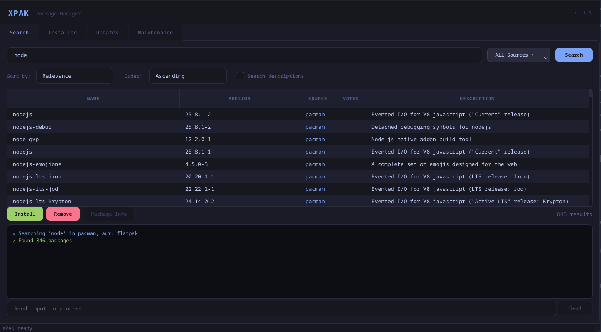
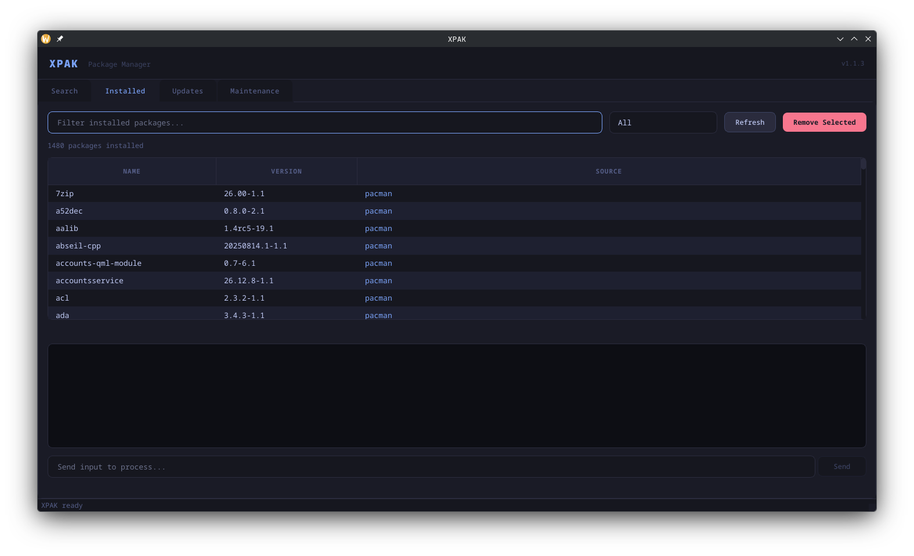
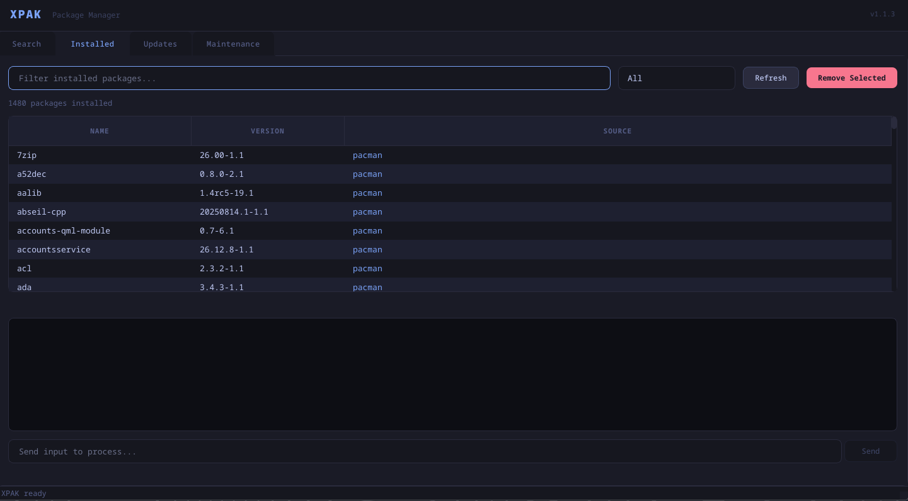
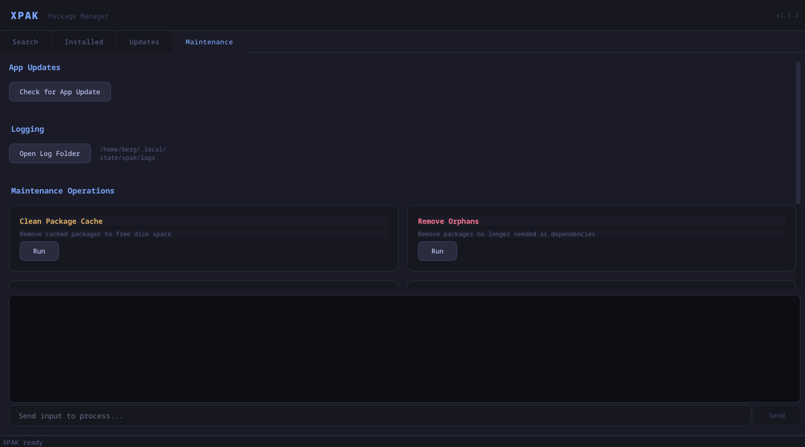

# XPAK

> **Disclaimer:** This is a work-in-progress application and may not be fully functional. Parts of the code are AI-generated. Use at your own risk.

A GUI package manager for Arch Linux and CachyOS with KDE Plasma. Built with Python and PyQt6.

Supports pacman (official repos), yay (AUR), and Flatpak — all from a single dark-themed interface.

---

## Screenshots






---

## Features

- Search across pacman, AUR, and Flatpak simultaneously (concurrent search)
- Install and remove packages from all three sources
- View all installed packages with filtering
- Check for and apply system updates (pacman, AUR, Flatpak)
- Maintenance tools: clean cache, remove orphans, sync databases, fix broken packages
- In-app update checker (checks GitHub releases)
- Startup tool check with guided installation for missing dependencies
- First-run startup update preferences for XPAK and installed packages
- Source selector dropdown (toggle pacman/AUR/Flatpak per search)
- Sort search results by name, version, or source

---

## Dependencies

| Dependency | Purpose | Install |
|---|---|---|
| `python-pyqt6` | GUI framework (required) | `sudo pacman -S python-pyqt6` |
| `yay` | AUR helper | Manual (see below) |
| `flatpak` | Flatpak support | `sudo pacman -S flatpak` |
| `pacman-contrib` | `checkupdates`, `paccache` | `sudo pacman -S pacman-contrib` |

Only `python-pyqt6` is strictly required. The others unlock additional features.

---

## Quick Install

```bash
bash <(curl -fsSL https://raw.githubusercontent.com/bberka/xpak/main/install.sh)
```

This will:
1. Check for git and python3
2. Install python-pyqt6 if missing
3. Clone xpak to `~/.local/lib/xpak/`
4. Create a launcher at `~/.local/bin/xpak`
5. Create a `.desktop` file for your app launcher

---

## Manual Install

```bash
# Install PyQt6
sudo pacman -S python-pyqt6

# Clone the repository
git clone https://github.com/bberka/xpak.git ~/.local/lib/xpak

# Create the launcher
mkdir -p ~/.local/bin
cat > ~/.local/bin/xpak << 'EOF'
#!/usr/bin/env bash
exec python3 "$HOME/.local/lib/xpak/xpak.py" "$@"
EOF
chmod +x ~/.local/bin/xpak

# Ensure ~/.local/bin is in PATH (add to ~/.bashrc or ~/.zshrc)
export PATH="$HOME/.local/bin:$PATH"
```

---

## KDE Plasma App Launcher Setup

To have xpak appear in KDE Plasma's application launcher (KRunner, app menu):

```bash
mkdir -p ~/.local/share/applications
cat > ~/.local/share/applications/xpak.desktop << 'EOF'
[Desktop Entry]
Name=XPAK
Comment=GUI Package Manager for Arch Linux / CachyOS
Exec=/home/YOUR_USERNAME/.local/bin/xpak
Icon=system-software-install
Terminal=false
Type=Application
Categories=System;PackageManager;
Keywords=package;manager;pacman;aur;flatpak;arch;
StartupWMClass=xpak
EOF

# Replace YOUR_USERNAME with your actual username
sed -i "s|Exec=.*|Exec=$HOME/.local/bin/xpak|" ~/.local/share/applications/xpak.desktop

# Refresh the desktop database
update-desktop-database ~/.local/share/applications
```

After this, xpak will appear in your KDE application menu and be searchable via KRunner (Alt+F2).

---

## Running from Terminal

```bash
xpak
```

Or directly:

```bash
python3 ~/.local/lib/xpak/xpak.py
```

---

## Installing yay (AUR Helper)

yay cannot be installed via pacman — it must be built from the AUR itself. This is a one-time bootstrapping step:

```bash
# Install build dependencies
sudo pacman -S --needed base-devel git

# Clone and build yay
git clone https://aur.archlinux.org/yay.git /tmp/yay-build
cd /tmp/yay-build
makepkg -si

# Verify installation
yay --version
```

Once yay is installed, AUR searching and installing will work in XPAK.

---

## Installing Optional Tools

```bash
# Flatpak support
sudo pacman -S flatpak

# Enable Flathub (main Flatpak repository)
flatpak remote-add --if-not-exists flathub https://dl.flathub.org/repo/flathub.flatpakrepo

# pacman-contrib (checkupdates + paccache)
sudo pacman -S pacman-contrib
```

---

## Usage Guide

### Search Tab

1. Type a package name or keyword in the search box
2. Use the "All Sources" dropdown to limit to specific sources (pacman, AUR, Flatpak)
3. Use the Sort controls to reorder results by Name, Version, Source, or Repo
4. "Search descriptions" is enabled by default so pacman-style keyword matches in package descriptions are included
5. Click a row to select a package
6. Click **Install** or **Remove** to operate on the selected package
7. Click **Package Info** to see full package details

AUR installs require your sudo password. This is used to pre-authenticate sudo so yay can operate without a terminal.

### Installed Tab

Lists all installed packages across pacman and Flatpak. Use the filter box to search by name. Use the source dropdown to narrow to pacman or Flatpak only. Click **Remove Selected** to uninstall.

### Updates Tab

Click **Check for Updates** to scan for available updates using `checkupdates` (pacman) and `flatpak remote-ls`. Then use:

- **Update All** — full pacman system upgrade (`pacman -Syu`)
- **Update Flatpaks** — update all Flatpak apps
- **Update AUR** — update AUR packages via yay

If enabled in the **Settings** tab on first launch, XPAK also checks this tab in the background on startup and shows a notification dialog when updates are found.

### Maintenance Tab

- **Check for XPAK Update** — queries GitHub releases to see if a new version of XPAK is available
- **Update to vX.Y.Z** — appears only when a newer XPAK release is found, runs `install.sh`, then restarts the app automatically
- **Clean Package Cache** — runs `paccache -r -k 2` (keeps 2 versions of each package)
- **Remove Orphans** — finds and removes unused dependency packages
- **Sync Databases** — runs `pacman -Sy`
- **Clean Flatpak Cache** — removes unused Flatpak runtimes
- **List Explicitly Installed** — shows packages you manually installed (not pulled in as deps)
- **Fix Broken Packages** — runs `pacman -Dk` to check for dependency issues

### Settings Tab

- Choose whether XPAK should check for XPAK updates on every startup
- Choose whether XPAK should check for installed package updates on every startup
- These preferences are also shown automatically the first time you open XPAK

---

## Updating XPAK

### Via install.sh (recommended)

```bash
bash ~/.local/lib/xpak/install.sh
```

Or re-run the one-liner:

```bash
bash <(curl -fsSL https://raw.githubusercontent.com/bberka/xpak/main/install.sh)
```

### Manually

```bash
cd ~/.local/lib/xpak
git pull
```

You can also use the **Check for XPAK Update** button in the Maintenance tab. If a new release is found, an **Update** button appears and XPAK can update and restart itself automatically.

---

## Troubleshooting

### "sudo: a terminal is required to read the password" when installing AUR packages

This is the core reason XPAK pre-authenticates sudo before calling yay. If you see this error, ensure you entered your password in the password dialog. XPAK runs `sudo -S true` with your password before launching yay, which caches credentials for the session.

### yay not found / AUR search returns nothing

yay is not in the official Arch repositories. Follow the yay installation steps above. XPAK's startup tool check will also prompt you with instructions if yay is missing.

### Flatpak packages not appearing in search

Ensure Flathub is added as a remote:

```bash
flatpak remote-add --if-not-exists flathub https://dl.flathub.org/repo/flathub.flatpakrepo
```

### checkupdates not found (Updates tab empty)

Install pacman-contrib:

```bash
sudo pacman -S pacman-contrib
```

### xpak command not found after install

Ensure `~/.local/bin` is in your PATH. Add to your shell config:

```bash
# ~/.bashrc or ~/.zshrc
export PATH="$HOME/.local/bin:$PATH"
```

For fish shell (`~/.config/fish/config.fish`):

```fish
fish_add_path ~/.local/bin
```

Then reload: `source ~/.bashrc` (or open a new terminal).

### XPAK doesn't appear in KDE app launcher

Run:

```bash
update-desktop-database ~/.local/share/applications
kbuildsycoca6
```

If `kbuildsycoca6` is not available, log out and log back in to KDE.

---

## License

MIT
